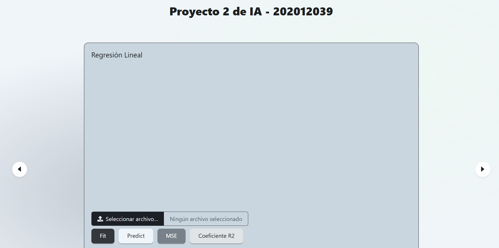

# PROYECTO 2

| Nombre                       | Carnet    |
| ---------------------------- | --------- |
| Angel Francisco Sique Santos | 202012039 |

# Manual de Usuario

**Proyecto de IA - 202012039**

Este manual describe los pasos para utilizar cada funcionalidad del proyecto de Inteligencia Artificial. A continuación, se detallan las secciones de regresión lineal, regresión polinomial, árbol de decisión ID3, y red neuronal.

---

## 1. Regresión Lineal

### Descripción
La funcionalidad de regresión lineal permite cargar un archivo CSV con datos y realizar un ajuste lineal, además de generar predicciones y calcular el error cuadrático medio (MSE) y el coeficiente de determinación \(R^2\).

### Pasos a seguir:
1. **Seleccionar archivo**: Cargar el archivo CSV con los datos que desea utilizar.
2. **Ajustar modelo (Fit)**: Presionar el botón **Fit** para entrenar el modelo.
3. **Predecir**: Presionar el botón **Predict** para realizar predicciones con el modelo ajustado.
4. **Calcular MSE y \(R^2\)**: Después de predecir, puede calcular el MSE y el coeficiente \(R^2\) para evaluar la precisión del modelo.

### Interfaz

---

## 2. Regresión Polinomial

### Descripción
La funcionalidad de regresión polinomial permite cargar un archivo CSV, definir el grado del polinomio, ajustar el modelo a los datos, hacer predicciones, y calcular el MSE y el coeficiente \(R^2\).

### Pasos a seguir:
1. **Seleccionar archivo**: Cargar el archivo CSV con los datos deseados.
2. **Especificar el grado del polinomio**: Ingresar el grado del polinomio en el campo correspondiente.
3. **Ajustar modelo (Fit)**: Presionar **Fit** para entrenar el modelo con el grado especificado.
4. **Predecir**: Hacer clic en **Predict** para realizar predicciones con el modelo ajustado.
5. **Calcular MSE y \(R^2\)**: Una vez hechas las predicciones, puede calcular el MSE y el coeficiente \(R^2\).

### Interfaz

---

## 3. Árbol de Decisión ID3

### Descripción
La funcionalidad de Árbol de Decisión ID3 permite cargar un archivo de entrenamiento y generar un árbol de decisión para realizar predicciones en base a nuevos datos.

### Pasos a seguir:
1. **Seleccionar archivo de entrenamiento**: Cargar el archivo de datos para entrenar el modelo.
2. **Generar Árbol**: Hacer clic en **Generar Árbol** para construir el modelo.
3. **Predecir**: Después de generar el árbol, puede cargar datos nuevos y hacer clic en **Predecir** para obtener resultados basados en el árbol generado.

### Interfaz

---

## 4. Red Neuronal

### Descripción
La funcionalidad de red neuronal permite entrenar un modelo de red neuronal con los datos cargados y realizar predicciones.

### Pasos a seguir:
1. **Seleccionar archivo de entrenamiento**: Cargar el archivo de datos para entrenar la red neuronal.
2. **Ajustar modelo**: Configurar los parámetros de la red neuronal según sea necesario y entrenar el modelo.
3. **Predecir**: Después de entrenar, puede utilizar la red neuronal para hacer predicciones con nuevos datos.

### Interfaz

---

## Observaciones

Para un uso correcto del sistema, asegúrese de cargar archivos en formato CSV y de que los datos estén bien formateados. Además, verifique que los campos requeridos estén completados antes de presionar los botones de ajuste, predicción o evaluación.
